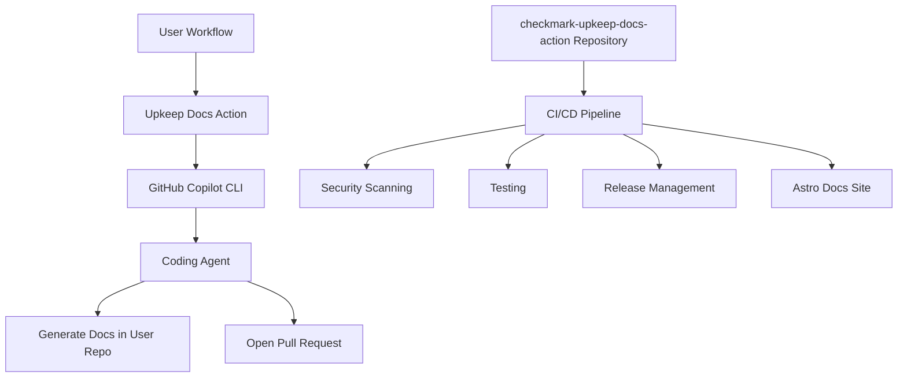

# Design Document

## Overview

Upkeep Docs is a GitHub Action that acts as a prompter for GitHub's coding agent via Copilot CLI. When triggered by a user's workflow, the action uses predefined prompts to instruct the coding agent to generate documentation directly in the user's repository and open a pull request with the changes. This repository maintains the action infrastructure, predefined prompts, and its own Astro-based documentation site.

## Architecture

### High-Level Architecture



### Component Structure

The repository is organized into several key components:

1. **Action Core** - The main GitHub Action implementation
2. **CI/CD Infrastructure** - Workflows for testing, security, and releases
3. **Documentation Site** - Astro-based documentation for users
4. **Release Management** - Semantic versioning and changelog automation

## Components and Interfaces

### 1. GitHub Action Core

**Language Choice**: JavaScript (Node.js)

- Faster startup time compared to Python
- Native GitHub Actions ecosystem support
- Excellent tooling and package management with npm
- Built-in support for GitHub API interactions

**Core Components**:

- `action.yml` - Action metadata and input/output definitions
- `src/main.js` - Primary action entry point
- `src/copilot-cli.js` - Copilot CLI setup and execution wrapper

- `src/utils.js` - Common utilities and error handling

**Input Parameters**:

```yaml
inputs:
  github-token:
    description: 'GitHub token for authentication'
    required: true

  custom-config:
    description: 'Path to custom configuration file'
    required: false
```

**Output Parameters**:

```yaml
outputs:
  pr-number:
    description: 'Pull request number created by coding agent'
  pr-url:
    description: 'URL of the pull request with generated documentation'
```

### 2. Copilot CLI Integration

**Authentication Flow**:

1. Receive GitHub token from user workflow
2. Configure Copilot CLI with provided token
3. Validate CLI availability and authentication
4. Execute predefined prompts to instruct coding agent

**CLI Wrapper Functions**:

```javascript
async function authenticateCopilotCLI(token) {}
async function promptCodingAgent(prompt, repoContext) {}
async function isCopilotCLIAvailable() {}
```

### 3. Prompt Execution

**Coding Agent Instructions**:

- Use predefined prompts optimized for documentation generation
- Provide repository context to the coding agent
- Instruct agent to generate documentation files in user's repo
- Request agent to open pull request with generated documentation

**Prompt Flow**:

1. Analyze repository structure and existing documentation
2. Generate appropriate documentation files (README, API docs, guides)
3. Create or update documentation in user's repository
4. Open pull request with generated documentation changes

### 4. CI/CD Infrastructure

**Security Workflows**:

- CodeQL analysis for vulnerability detection
- Dependency scanning with Dependabot
- Security policy enforcement
- Secret scanning prevention

**Testing Workflows**:

- Unit tests for all core functionality
- Integration tests with mock Copilot CLI
- Action testing in isolated environments
- Beta release validation

**Release Workflows**:

- Semantic versioning with conventional commits
- Automated changelog generation
- Tag and release management

### 5. Documentation Site (Astro)

**Site Structure**:

```
docs-site/
├── src/
│   ├── pages/
├── public/
└── astro.config.mjs
```

**Content Sections**:

- Getting Started guide
- API reference
- Usage examples
- Security documentation
- Troubleshooting guides

**Deployment**:

- Build with Astro static site generator
- Deploy to GitHub Pages using artifacts
- Automated deployment on releases

## Data Models

### Action Configuration

```javascript
{
  githubToken: string,
  outputDirectory: string,
  customConfig?: string,
  debug?: boolean
}
```

### Execution Context

```javascript
{
  repository: {
    owner: string,
    name: string,
    branch: string
  },
  workflow: {
    runId: string,
    actor: string
  },
  copilotCli: {
    version: string,
    authenticated: boolean
  }
}
```

### Execution Results

```javascript
{
  pullRequestNumber: number,
  pullRequestUrl: string,
  executionTime: number,
  codingAgentResponse: string,
  errors: string[],
  warnings: string[]
}
```

## Error Handling

### Error Categories

1. **Authentication Errors**
   - Invalid GitHub token
   - Copilot CLI authentication failure
   - Insufficient permissions

2. **CLI Errors**
   - Copilot CLI not available
   - CLI execution timeout
   - Invalid CLI responses

3. **Configuration Errors**
   - Invalid input parameters
   - Malformed configuration files
   - Missing required inputs

### Error Response Strategy

- Fail fast with clear error messages
- Provide actionable troubleshooting steps
- Log errors without exposing sensitive information
- Return appropriate exit codes for workflow integration

## Testing Strategy

### Unit Testing

- Test individual components in isolation
- Mock external dependencies (GitHub API, file system)
- Validate input/output processing
- Test error handling scenarios

### Integration Testing

- Test complete action execution flow
- Use test repositories for validation
- Verify Copilot CLI integration
- Test various configuration scenarios

### Beta Testing

- Deploy to test environment
- Run against sample repositories
- Performance and reliability testing

### Test Structure

```plaintext
tests/
├── unit/
│   ├── copilot-cli.test.js
│   └── utils.test.js
├── integration/
│   ├── action-execution.test.js
│   └── end-to-end.test.js
└── fixtures/
    ├── sample-repos/
    └── mock-responses/
```

## Security Considerations

### Token Handling

- Never log or expose GitHub tokens
- Use tokens only for intended Copilot CLI authentication
- Implement token validation and scope checking
- Clear tokens from memory after use

### Input Validation

- Sanitize all user inputs
- Validate configuration file contents

### Dependency Security

- Regular dependency updates
- Vulnerability scanning in CI/CD
- Pin dependency versions
- Use minimal dependency footprint

### Action Security

- Follow GitHub Action security best practices
- Implement least-privilege access patterns
- Provide clear security documentation
- Regular security audits and updates

### Required Token Permissions

**Baseline Goal**: Use default GITHUB_TOKEN permissions where possible

**Default GITHUB_TOKEN permissions**:

- `contents: read` - Read repository contents
- `metadata: read` - Read repository metadata
- `actions: read` - Read workflow information

**Additional permissions likely needed**:

- `contents: write` - Allow coding agent to create/modentation files
- `pull-requests: write` - Allow coding agent to create pull requests

**Documentation Requirements**:

- Document exact permissions needed in action README
- Provide examples of minimal permission configuration
- Explain why each permission is necessary
- Offer alternatives if users want more restrictive permissions

## Repository Organization

### ChecKMarK Organization

- Repository lives under the ChecKMarK organization
- Dual licensed under organization structure
- Maintains organization branding and standards
- No contributors - solo project built for free

### Repository README Features

**Static Badges (shields.io)**:

- License badge
- Version/release badge
- Build status badge
- Code quality badges
- Repository stats (stars, forks, issues)

**Social Links**:

- Dev.to profile
- LinkedIn profile
- Reddit profile
- Buy me a coffee link

## Licensing

### Polyform Shield 1.0.0 License

- Repository includes my custom Polyform Shield 1.0.0 license file
- All package metadata references the license
- Action includes proper license attribution
- License compliance maintained throughout development
- Dual licensed under checkmark organization structure
